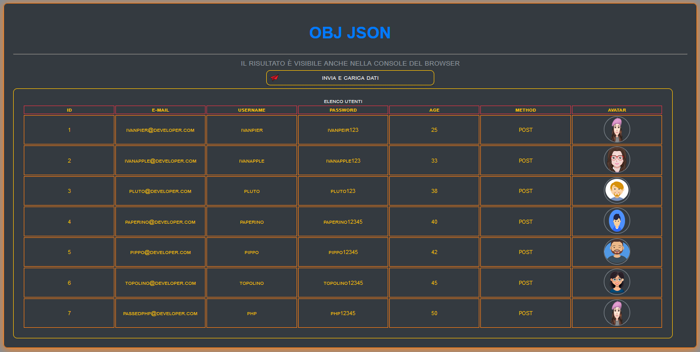

# INIZIO

Lavorare su dati obj e json

<a href="https://ivanpierdeveloper.github.io/obj-json/" target="_blank">vai all'APP ^__^</a>

NOTA:

Si consiglia di scarica l'app per il suo corretto funzionamento

# FINE
